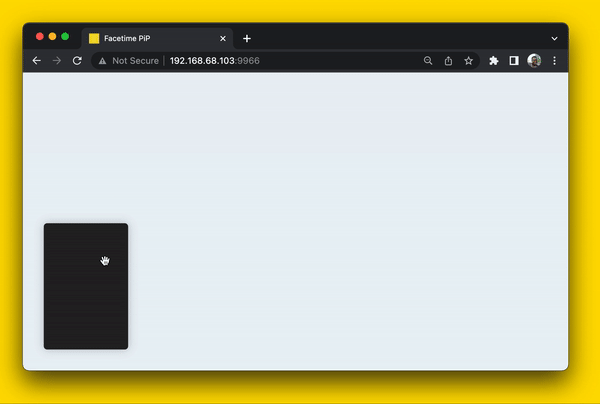

# FaceTime PiP 

Lately I've been trying to get more into animation on the web. The way that I've been approaching it is different from how I would've apprached it in the past. In the past, I was really into choreographed static animations such as [GreenSock](https://greensock.com/) and [anime.js](https://animejs.com/). Now, I'm more into natural animations and finding ways to think about animations intuitively as **interruptible states** and spaces vs. start and end points. Here's a demo inspired by a [talk about fluid interruptible animations](https://developer.apple.com/videos/play/wwdc2018/803/) at Apple's WWDC conference.

I'm also writing my own [guide](https://www.notion.so/olagun/Physically-Based-Animations-in-JavaScript-9431d7bb060848948c761706d47d205c) on how to create natural animations with JavaScript. Stay tuned! 

## Getting Started
1. `git clone https://github.com/olagun/facetime-pip.git`
2. `cd facetime-pip`
3. `npm i -g budo`
4. `budo`

## Resources

- [Designing Fluid Interfaces](https://developer.apple.com/videos/play/wwdc2018/803/)
- [Building Fluid Interfaces](https://medium.com/@nathangitter/building-fluid-interfaces-ios-swift-9732bb934bf5)

MIT License